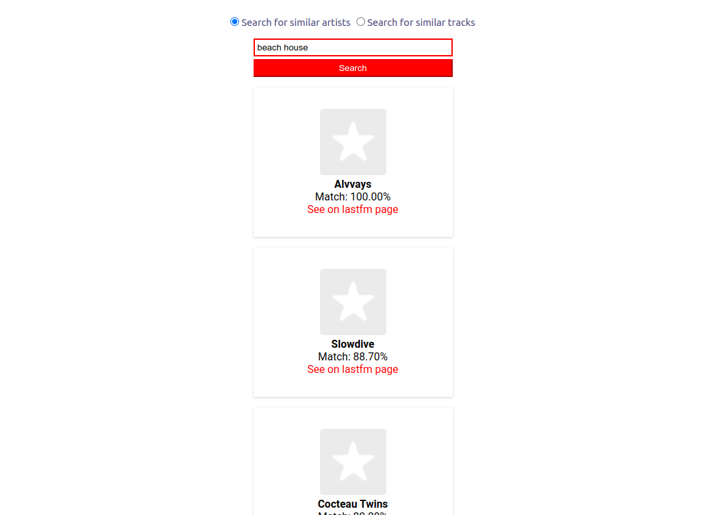

# lastfm-similarity-finder

## [EN-US]
An application that searches for similar artists/tracks using the [lastfm API](https://www.last.fm/api/intro).

This app is built with:

- [React.js](https://reactjs.org/docs/getting-started.html)
- [axios](https://axios-http.com/docs/intro)
- [uuid](https://www.npmjs.com/package/uuid) (for randomly generated ids)

### Instructions to run the app locally*:

1. Download the repository
2. Install the app dependencies with the following command:
```
npm install
```
3. Run the app:
```
npm start
```
<sup>*You must have node.js installed in your machine.</sup>

obs: similar tracks functionality still needs improvement. Working on that.

## [PT-BR]

Um app que procura artistas/faixas semelhantes usando a [API do lastfm](https://www.last.fm/api/intro).

Tecnologias utilizadas:

- [React.js](https://reactjs.org/docs/getting-started.html)
- [axios](https://axios-http.com/docs/intro)
- [uuid](https://www.npmjs.com/package/uuid) (para gerar ids aleatórios)

### Instruções para rodar o app localmente*:

1. Faça o download
2. Instale as dependências do app com o comando:
```
npm install
```
3. Para rodar o app:
```
npm start
```
<sup>*Você precisa ter o node.js instalado na sua máquina</sup>

obs: a funcionalidade que procura por tracks similares ainda precisa de ajustes. Ainda trabalhando nisso.


